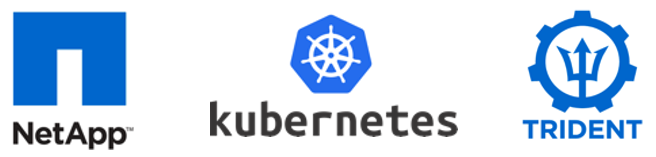
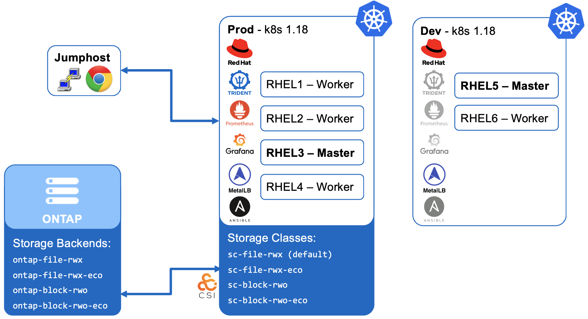

# NetApp Trident Bootcamp

## Trident with Kubernetes

This bootcamp requires the [NetApp Lab-on-Demand](https://labondemand.netapp.com/) "Trident with Kubernetes and ONTAP v3.1" lab which comes with Trident 19.07 already installed on Kubernetes 1.15.3. The provided [configure_bootcamp.sh](trident_with_k8s/deploy/configure_bootcamp.sh) within this repo will modify the environment to be ready for the tasks within this bootcamp to be carried out.

**The configure_bootcamp.sh script may be run by the NetApp Lab On Demand team ahead of you connecting to the lab environment, so please confirm this with the person running your particular bootcamp.**  If it has not been run, it can take ~15 minutes to complete, so please run it now by following the instructions [here](trident_with_k8s/tasks/configure_bootcamp) where you will also find details of the tasks carried out by the script.

## Bootcamp Environment Diagram

To familiarise yourself with the environment and check that everything is ready for you to begin, please follow the instructions in [Task 1](trident_with_k8s/tasks/verify_lab).  Once you are happy with your lab, you can choose to jump into any of the tasks listed below.  They do not need to be followed in any particular order, but if persistent storage is a new concept for you within k8s, it is recomended to follow them one-by-one.  If you do jump ahead, any pre-requisite tasks will be called out for you.

### K8s and Vim Commands

You will be using Vim to edit configuration files as part of this bootcamp.  If you are unfamiliar with Vim, a [basic set of instructions](trident_with_k8s/tasks/vim) has been created for you to keep open in a separate browser tab for reference

There is also a set of [useful k8s commands](trident_with_k8s/tasks/useful_commands) available in case you need them during the bootcamp.  Again, it may be worthwhile having these open in a separate browser tab for easy reference.

---------

### Prod k8s Cluster Tasks

You don't have to carry out these tasks in order, but they are ordered in a way that would give the most logical flow to anyone new to k8s and persistent storage.  Once you have completed the 'Verify' lab, feel free to either follow them one-by-one or jump into the tasks that interest you the most.

Do this first: 

* [Verify and navigate the lab environment](trident_with_k8s/tasks/verify_lab)  

then:

* [Deploy your first application with File storage](trident_with_k8s/tasks/file_app)  
* [Deploy your first application with Block storage](trident_with_k8s/tasks/block_app)  
* [Use the 'import' feature of Trident](trident_with_k8s/tasks/pv_import)  
* [Consumption control with quotas](trident_with_k8s/tasks/quotas)  
* [Resize an NFS PVC](trident_with_k8s/tasks/resize_file)  
* [Using Virtual Storage Pools](trident_with_k8s/tasks/storage_pools)  
* [StatefulSets & Storage consumption](trident_with_k8s/tasks/statefulsets)  
* [Resize an iSCSI PVC](trident_with_k8s/tasks/resize_block)  
* [On-Demand Snapshots & Cloning PVCs from Snapshots](trident_with_k8s/tasks/snapshots_clones)  
* [Dynamic export policy management](trident_with_k8s/tasks/dynamic_exports)  

---------

### Dev k8s Cluster Tasks

If you would like to carry out some of the tasks performed for you by the configure_bootcamp.sh script, below are the commands required.  These can be useful if you wish to become familar with tasks such as installing Trident or defining storage classes and should be run against the dev cluster via host **rhel5**:

* [Install/Upgrade Trident with an Operator](trident_with_k8s/tasks/install_trident)  
* [Install Prometheus & incorporate Trident's metrics](trident_with_k8s/tasks/config_prometheus)  
* [Configure Grafana & add your first graphs ](trident_with_k8s/tasks/config_grafana)  
* [Configure your first NAS backends & storage classes](trident_with_k8s/tasks/config_file)  
* [Configure your first iSCSI backends & storage classes](trident_with_k8s/tasks/config_block)  
* [Specify a default storage class](trident_with_k8s/tasks/default_sc)  
* [Prepare ONTAP for block storage on dev cluster](trident_with_k8s/tasks/ontap_block)  

---------
**Page navigation**  
[Top of Page](#top) | [Home](/README.md) | [Full Task List](/README.md#prod-k8s-cluster-tasks)
