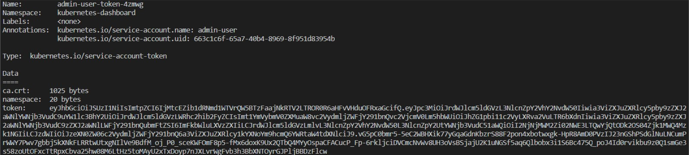
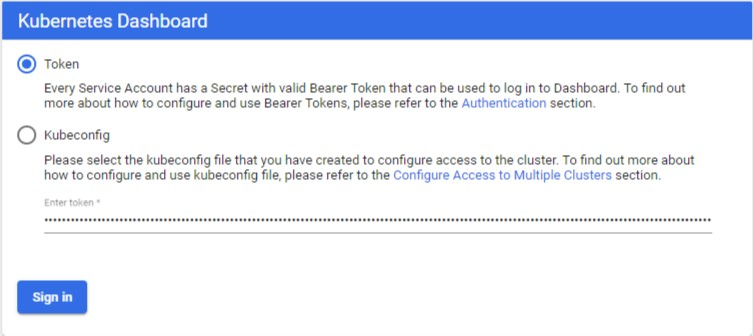

<p align="center"></p>

# LabNetApp

## A. Trident with K8s (with CSI)

The section has been tested with the Lab-on-Demand Using "Trident with Kubernetes and ONTAP v3.1" which comes by default with Trident 19.07 already installed on Kubernetes 1.15.3. The configure_bootcamp.sh will modify the environment by:

- Installing and creating a MetalLB configuration
- Upgading k8s to 1.18
- Add rhel4 as a worker node to the production k8s cluster
- Initialize and configure a 2nd k8s cluster (nodes rhel5 and rhel6)
- Install and configure Prometheus and Grafana dashboards
- Install and configure Trident with an Operator

### Bootcamp Environment Diagram

<p align="center"></p>

:boom:  
Most labs will be done by connecting with Putty to the RHEL3 host (root/Netapp1!).  
I assume each scenario will be run in its own directory. Also, you will find a README file for each scenario.  

Last, there are plenty of commands to write or copy/paste.  
Most of them start with a '#', usually followed by the result you would get.  
:boom:  

### Configuring the bootcamp k8s environment

Open the PuTTY console and connect to the kubernetes master node as root@rhel3. Run the below commands to configure the kubernetes clusters for the bootcamp:  

```bash
git clone https://github.com/carlgranfelt/NetApp-LoD.git  
cd NetApp-LoD/trident_with_k8s/deploy/  
chmod 744 *.sh  
. ./configure_bootcamp.sh
```

### Vim 101 commands

Vim is a “modal” text editor based on the vi editor. In Vim, the mode that the editor is in determines whether the alphanumeric keys will input those characters or move the cursor through the document. Listed below are some basic commands to move, edit, search and replace, save and quit.

|Vim Command             | Description
|------------------------|--------------------------------------------------------------|
| i                      | Enter insert mode |
| Esc                    | Enter command mode |
| x or Del               | Delete a character |
| X                      | Delete character is backspace mode |
| u                      | Undo the last operation |
| Ctrl + r               | Redo the last undo |
| yy                     | Copy a line |
| d                      | Starts the delete operation |
| dw                     | Delete a word |
| d0                     | Delete to the beginning of a line |
| d$                     | Delete to the end of a line |
| dd                     | Delete a line |
| p                      | Paste the content of the buffer |
| /<search_term>         | Search for text and then cycle through matches with n and N |
| [[ or gg               | Move to the beginning of a file |
| ]] or G                | Move to the end of a file |
| :%s/foo/bar/gci        | Search and replace all occurrences with confirmation |
| Esc + :w               | Save changes |
| Esc + :wq or Esc + ZZ  | Save and quit Vim |
| Esc + :q!              | Force quit Vim discarding all changes |

### Kubernetes web-based UI

For more information about the kuberenetes dashboard, please see:  
<https://github.com/kubernetes/dashboard>.

Access the k8s dashboard from a web browser at:  
<https://192.168.0.142/>.  

Click on **Advanced** in the 'Your connecton is not private' window, follwed by 'Proceed to 192.168.0.142 (unsafe)'.

Getting a Bearer Token  
Now we need to find token we can use to log in. Execute following command in the original terminal window:  
`kubectl -n kubernetes-dashboard describe secret $(kubectl -n kubernetes-dashboard get secret | grep admin-user | awk '{print $1}')`

It should display something similar to below:


Copy the token and paste it into Enter token field on the login screen.


### Tasks

---------
[1.](trident_with_k8s/tasks/install_trident) Install/Upgrade Trident with an Operator - remove tridentctl 0  
[2.](trident_with_k8s/tasks/config_prometheus) Install Prometheus & incorporate Trident's metrics0  
[3.](trident_with_k8s/tasks/config_grafana) Configure Grafana & add your first graphs0  
[4.](trident_with_k8s/tasks/config_file) Configure your first NAS backends & storage classes0  
[5.](trident_with_k8s/tasks/file_app) Deploy your first app with File storage  
[6.](trident_with_k8s/tasks/config_block) Configure your first iSCSI backends & storage classes0  
[7.](trident_with_k8s/tasks/block_app) Deploy your first app with Block storage  
[8.](trident_with_k8s/tasks/pv_import) Use the 'import' feature of Trident  
[9.](trident_with_k8s/tasks/quotas) Consumption control  
[10.](trident_with_k8s/tasks/file_resize) Resize a NFS CSI PVC  
[11.](trident_with_k8s/tasks/storage_pools) Using Virtual Storage Pools  
[12.](trident_with_k8s/tasks/statefulsets) StatefulSets & Storage consumption  
[13.](trident_with_k8s/tasks/resize_block) Resize a iSCSI CSI PVC  
[14.](trident_with_k8s/tasks/snapshots_clones) On-Demand Snapshots & Create PVC from Snapshot  
[15.](trident_with_k8s/tasks/dyanmic_exports) Dynamic export policy management  

### Dev K8s Cluster Tasks

---------
[0.](trident_with_k8s/tasks/useful_commands) Useful commands  
[2.](trident_with_k8s/tasks/default_sc) Specify a default storage class  
[5.](trident_with_k8s/tasks/ontap_block) Prepare ONTAP for block storage on dev cluster  
