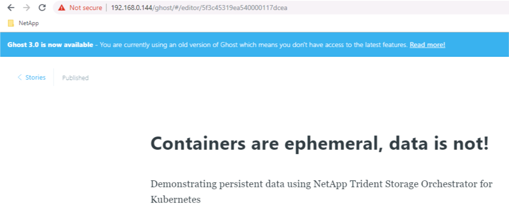

# Create your first Application with Block (RWO) storage

**Objective:**  
We will deploy the same application as in file-base application task, but instead of using RWX storage, we will use RWO Block Storage.

For this task you will be deploying Ghost (a light weight web portal) utlilising RWO (Read Write Once) file-based persistent storage over iSCSI.  You will find a few .yaml files in the Ghost directory, so ensure that your putty terminal on the lab is set to the correct directory for this task:

```bash
[root@rhel3 ~]# cd /root/netapp-bootcamp/trident_with_k8s/tasks/block_app/ghost
```

The .yaml files provided are for:

- A PVC to manage the persistent storage of this application
- A DEPLOYMENT that will define how to manage the application
- A SERVICE to expose the application

Feel free to familiarise yourself with the contents of these .yaml files if you wish.  You will see in the ```1_pvc.yaml``` file that it specifies ReadWriteOnce as the access mode, which will result in k8s and Trident providing an iSCSI based backend for the request.  A diagram is provided below to illustrate how the PVC, deployment, service and surrounding infrastructure all hang together:

<p align="center"></p>

## A. Create the application

It is assumed that the required backend & storage class have [already been created](../config_file) either by you or your bootcamp facilitator.

We will create this application in its own namespace (which also makes clean-up easier):

```bash
[root@rhel3 ~]# kubectl create namespace ghostsan
namespace/ghostsan created
```

Next, we apply the .yaml configuration within the new namespace:

```bash
[root@rhel3 ~]# kubectl create -n ghostsan -f ../ghost/
persistentvolumeclaim/blog-content created
deployment.apps/blog created
service/blog created
```

Feel free to refresh your Grafana dashboard to see it now shows another volume is managed.

Display all resources for the ghostsan namespace (your specific pod name of blog-san-XXXXXXXX-XXXX will be unique to your deployment and will need to be used again later in this task):  

```bash
[root@rhel3 ghost]# kubectl get all -n ghostsan
NAME                            READY   STATUS    RESTARTS   AGE
pod/blog-san-86658f65cd-wtxh4   1/1     Running   0          102s

NAME               TYPE           CLUSTER-IP      EXTERNAL-IP     PORT(S)        AGE
service/blog-san   LoadBalancer   10.97.125.117   192.168.0.144   80:30090/TCP   102s

NAME                       READY   UP-TO-DATE   AVAILABLE   AGE
deployment.apps/blog-san   1/1     1            1           102s

NAME                                  DESIRED   CURRENT   READY   AGE
replicaset.apps/blog-san-86658f65cd   1         1         1       102s
```

Some k8s objects are hidden from the ```kubectl get all``` command output. To display the PV and PVC associated with your application we need to run a separate command:

```bash
[root@rhel3 ghost]# kubectl get pv,pvc -n ghostsan
NAME                                                        CAPACITY   ACCESS MODES   RECLAIM POLICY   STATUS   CLAIM                       STORAGECLASS   REASON   AGE
persistentvolume/pvc-0c5f0afa-987e-4287-98cf-a506e0b0d0eb   5Gi        RWX            Delete           Bound    ghost/blog-content          sc-file-rwx             5m36s
persistentvolume/pvc-c12d3e69-da33-4748-bcd4-098c857ea34b   5Gi        RWO            Delete           Bound    ghostsan/blog-content-san   sc-block-rwo            4m43s

NAME                                     STATUS   VOLUME                                     CAPACITY   ACCESS MODES   STORAGECLASS   AGE
persistentvolumeclaim/blog-content-san   Bound    pvc-c12d3e69-da33-4748-bcd4-098c857ea34b   5Gi        RWO            sc-block-rwo   4m45s
```

**Note:** If you have already created the file app and didn't perform the cleanup afterwards you will also see the PV for the ghost namespace as persistent volumes are not namespace specific objects.

## B. Access the application

It can take up to 1 minute for the POD to be in a *running* state.

The Ghost service is configured with a LoadBalancer type, which means you need to find the **external IP** for your application so that you can connect to it via a web browser in your lab:

```bash
[root@rhel3 ghost]# kubectl get svc -n ghostsan
NAME       TYPE           CLUSTER-IP      EXTERNAL-IP     PORT(S)        AGE
blog-san   LoadBalancer   10.97.125.117   192.168.0.144   80:30090/TCP   11m
```

Grab the external IP from the output and check to see if you can browse to your new ghost application with persistent iSCSI storage.  

**Note:** Your IP address might be different!  

## C. Explore the application container

Let's see if the */var/lib/ghost/content* folder is indeed mounted to the SAN PVC that was created.
**You need to customize the following commands with the POD name you have in your environment.**

```bash
[root@rhel3 ghost]# kubectl exec -n ghostsan blog-san-86658f65cd-wtxh4 -- df /var/lib/ghost/content
Filesystem           1K-blocks      Used Available Use% Mounted on
/dev/sdc               5029504     20944   4730032   0% /var/lib/ghost/content
```

List out the files found in the ghost/content directory within the PV (don't forget to use your specific blog-san-XXXXXXXX-XXXX details found in the earlier CLI output):

```bash
[root@rhel3 ghost]# kubectl exec -n ghostsan blog-san-86658f65cd-wtxh4 -- ls /var/lib/ghost/content
apps
data
images
logs
lost+found
settings
themes
```

It is recommended that you also monitor your environment from the pre-created dashboard in Grafana: (<http://192.168.0.141>).  If you carried out the tasks in the [verifying your environment](../verify_lab) task, then you should already have your Grafana username and password which is ```admin:admin``` by default and you will be promoted for a new password on 1st login.

## D. Confirm data persistence

Access the Ghost admin portal using the LoadBalancer address on <http://192.168.0.144/admin>  

**Note:** Your IP address might be different!  

```bash
root@rhel3 ghost]# kubectl get svc -n ghostsan
NAME       TYPE           CLUSTER-IP      EXTERNAL-IP     PORT(S)        AGE
blog-san   LoadBalancer   10.97.125.117   192.168.0.144   80:30090/TCP   21m
```

**Note:** The portal will automatically forward you to <http://192.168.0.144/ghost/#/setup/one>

Complete the Ghost setup using following steps:

1. Select 'Create your account'  
2. Give your Blog site a title
3. Enter your name
4. Give it an email address in correct format, for example user@user.com
5. Enter a password that you will remember
6. Finally, press on 'Last step: Invite your team' to proceed

<p align="center"></p>

Optionally select to save the password in Chrome.

Instead of inviting any team members select 'I'll do this later, take me to my blog!'

<p align="center"></p>

Select 'New story' from the main Stories page:

<p align="center"></p>

Give your blog post a title and add some content. Select Publish (from the top right hand corner),followed by Publish in the 'Ready to publish your post' pop-up window.  

<p align="center"></p>

Go back to the main Stories page (link in the top left corner) to confirm the presence of your blog post:

<p align="center"></p>

**Note:** Due to DNS limitations selecting 'View Post' will not work in this lab environment, but you can go to the main home page at  <http://192.168.0.144> to see your post is now live.

Next let's confirm which worker node your pod is running on. In a separate PuTTY window, you want to position them so that you can see the output on both windows at the same time, issue the following watch command:

`watch -n1 kubectl get pod -l app=blog-san -n ghostsan -o wide`

```bash
Every 1.0s: kubectl get pod -l app=blog-san -n ghostsan -o wide                                                                   Tue Aug 18 21:04:55 2020

NAME                        READY   STATUS    RESTARTS   AGE   IP          NODE    NOMINATED NODE   READINESS GATES
blog-san-86658f65cd-wtxh4   1/1     Running   0          32m   10.42.0.2   rhel4   <none>           <none>
```

If we had multiple pods in the namespace using the selector (-l, --selector='': Selector (label query)) would be crucial to to filter the desired output.

Now that we know that our pod is running on node ```rhel4``` (in this example) we can drain the node in preparation for maintenance which will also restart the pod on another node but first let's verify the status of our nodes:

```bash
[root@rhel3 ghost]# kubectl get no
NAME    STATUS   ROLES    AGE    VERSION
rhel1   Ready    <none>   344d   v1.18.0
rhel2   Ready    <none>   344d   v1.18.0
rhel3   Ready    master   344d   v1.18.0
rhel4   Ready    <none>   5d4h   v1.18.0
```

Next we can drain our node.

**Make sure to drain the node that is running your particular instance of the ghost blog, as it may be different to this example**.

```bash
[root@rhel3 ghost]# kubectl drain rhel4 --ignore-daemonsets
node/rhel4 cordoned
WARNING: ignoring DaemonSet-managed Pods: kube-system/kube-proxy-lcx85, kube-system/weave-net-kwmmp, metallb-system/speaker-qf8np, monitoring/prom-operator-prometheus-node-exporter-ltqkt, trident/trident-csi-zvrb2
evicting pod ghost/blog-6bf7df48bb-qwsrb
evicting pod ghostsan/blog-san-86658f65cd-wtxh4
pod/blog-san-86658f65cd-wtxh4 evicted
pod/blog-6bf7df48bb-qwsrb evicted
node/rhel4 evicted
```

**Note:** You might have to use --delete-local-data to override  Pods with local storage.

From above console output We can confirm that both the our pod and node have been evicted. In our "watch" window again we can confirm that we have a new pod (with a new random string pod name), notice how the age has been reset, and that the new pod has been scheduled to run on on a different host:  

```bash
Every 1.0s: kubectl get pod -l app=blog-san -n ghostsan -o wide                                                                   Tue Aug 18 21:07:22 2020

NAME                        READY   STATUS    RESTARTS   AGE   IP          NODE    NOMINATED NODE   READINESS GATES
blog-san-86658f65cd-76qw6   1/1     Running   0          55s   10.44.0.8   rhel2   <none>           <none>
```

**Note:** Press ```Ctrl-C``` to escape the watch window.  

Finally refresh your browser window and actually access your blog post to confirm it still exists:

<p align="center"></p>

Confirm that status of our nodes:

```bash
[root@rhel3 ghost]# kubectl get no
NAME    STATUS                     ROLES    AGE    VERSION
rhel1   Ready                      <none>   344d   v1.18.0
rhel2   Ready                      <none>   344d   v1.18.0
rhel3   Ready                      master   344d   v1.18.0
rhel4   Ready,SchedulingDisabled   <none>   5d4h   v1.18.0
```

To mark our node that was drained as schedulable again we need to uncordon it and verify that it's in a ready status.  Again, make sure to select the particular node that you drained as it may be different from this example:

```bash
[root@rhel3 ghost]# kubectl uncordon rhel4
node/rhel4 uncordoned

[root@rhel3 ghost]# kubectl get no
NAME    STATUS   ROLES    AGE    VERSION
rhel1   Ready    <none>   344d   v1.18.0
rhel2   Ready    <none>   344d   v1.18.0
rhel3   Ready    master   344d   v1.18.0
rhel4   Ready    <none>   5d4h   v1.18.0
```

## F. CHAP, rotating credentials and updating backends

Bi-directional CHAP authentication has already been setup as part of the bootcamp deployment for the production kubernetes cluster. Let's start by confirming that indeed bi-directional authentication has been enabled.  

First we need to reconfirm what node our pod is running on:  

```bash
[root@rhel3 ghost]# kubectl get pod  -n ghostsan -o wide
NAME                        READY   STATUS    RESTARTS   AGE   IP          NODE    NOMINATED NODE   READINESS GATES
blog-san-86658f65cd-76qw6   1/1     Running   0          25m   10.44.0.8   rhel2   <none>           <none>
```

Next, we run a remote ```iscsiadm``` command over SSH (against said node) to verify:

```bash
[root@rhel3 ghost]# ssh -o "StrictHostKeyChecking no" root@rhel2 iscsiadm -m session -P3
iSCSI Transport Class version 2.0-870
version 6.2.0.874-7
Target: iqn.1992-08.com.netapp:sn.2829ebfb4d6a11e8a5dc005056b08451:vs.2 (non-flash)
...
                *****
                CHAP:
                *****
                username: uh2aNCLSd6cNwxyz
                password: ********
                username_in: iJF4heBRT0TCwxyz
                password_in: ********
```

The presence of both inbound and target usernames & secrets confirm that bidirectional CHAP authentication has been correctly setup.  

### Rotating credentials and updating backends

The CHAP credentials can be rotated by updating the CHAP parameters in the corresponding backend.json file. This will require updating the CHAP secrets and using the ```tridentctl update``` command to reflect these changes.

New backend.json files with updated CHAP passwords has been provided for both the ontap-block-rwo and ontap-block-rwo-eco backends.

```bash
[root@rhel3 ghost]# tridentctl update backend ontap-block-rwo -f ../backend-ontap-san.json -n trident
+-----------------+----------------+--------------------------------------+--------+---------+
|      NAME       | STORAGE DRIVER |                 UUID                 | STATE  | VOLUMES |
+-----------------+----------------+--------------------------------------+--------+---------+
| ontap-block-rwo | ontap-san      | c3f5c053-0e18-48fa-b0ba-92bfe22e5e97 | online |       1 |
+-----------------+----------------+--------------------------------------+--------+---------+

[root@rhel3 ghost]# tridentctl update backend ontap-block-rwo-eco -f ../backend-ontap-san-eco.json -n trident
+---------------------+-------------------+--------------------------------------+--------+---------+
|        NAME         |  STORAGE DRIVER   |                 UUID                 | STATE  | VOLUMES |
+---------------------+-------------------+--------------------------------------+--------+---------+
| ontap-block-rwo-eco | ontap-san-economy | 7064da15-6271-4d47-8807-4097ac3ca76b | online |       0 |
+---------------------+-------------------+--------------------------------------+--------+---------+
```

**Note:** When updating the CHAP secrets for a backend, you must use tridentctl to update the backend. Do not update the credentials on the storage cluster through API/CLI/ONTAP UI as Trident will not be able to pick up these changes.  

Existing connections will remain unaffected; they will continue to remain active if the credentials are updated by Trident on the SVM. New connections will use the updated credentials. Disconnecting and reconnecting old PVs will result in them using the updated credentials.

To easily verify the new credentials we can simply create a new persistent volume claim for example using our ontap-san-economy driver:

```bash
[root@rhel3 ghost]# kubectl create -f ../eco_pvc.yaml -n ghostsan
persistentvolumeclaim/blog-content-san-eco created

[root@rhel3 ghost]# tridentctl -n trident get backend ontap-block-rwo-eco
+---------------------+-------------------+--------------------------------------+--------+---------+
|        NAME         |  STORAGE DRIVER   |                 UUID                 | STATE  | VOLUMES |
+---------------------+-------------------+--------------------------------------+--------+---------+
| ontap-block-rwo-eco | ontap-san-economy | 7064da15-6271-4d47-8807-4097ac3ca76b | online |       1 |
+---------------------+-------------------+--------------------------------------+--------+---------+
```

The presence of new volume confirms our new CHAP credentials are working. For a more comprehensive verification, you could for example delete the blog-san deployment, re-create it using above steps followed by running the iscsiadm command against the worker node running the pod.  

## E. Cleanup

Instead of deleting each object one by one, you can directly delete the namespace which will then remove all of its objects.

```bash
[root@rhel3 ghost]# kubectl delete ns ghostsan
namespace "ghostsan" deleted
```

## E. What's next

Now that you have tried working with SAN backends, you can try to resize a PVC:

- Next task: [Import an existing volume with Trident](../pv_import)  
or jump ahead to...
- [Resize a iSCSI CSI PVC](../resize_block)  

---
**Page navigation**  
[Top of Page](#top) | [Home](/README.md) | [Full Task List](/README.md#prod-k8s-cluster-tasks)
