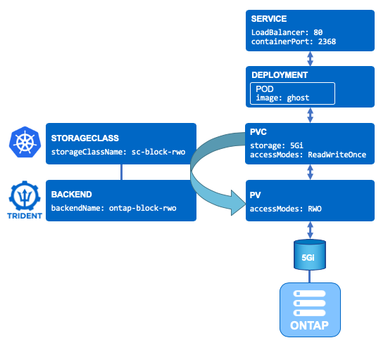

# Create your first Application with Block (RWO) storage

**Objective:**  
We will deploy the same application as in file-base application task, but instead of using RWX storage, we will use RWO Block Storage.

For this task you will be deploying Ghost (a light weight web portal) utlilising RWO (Read Write Once) file-based persistent storage over iSCSI.  You will find a few .yaml files in the Ghost directory, so ensure that your putty terminal on the lab is set to the correct directory for this task:

```bash
[root@rhel3 ~]# cd /root/netapp-bootcamp/trident_with_k8s/tasks/block_app/ghost
```

The .yaml files provided are for:

- A PVC to manage the persistent storage of this application
- A DEPLOYMENT that will define how to manage the application
- A SERVICE to expose the application

Feel free to familiarise yourself with the contents of these .yaml files if you wish.  You will see in the ```1_pvc.yaml``` file that it specifies ReadWriteOnce as the access mode, which will result in k8s and Trident providing an iSCSI based backend for the request.  A diagram is provided below to illustrate how the PVC, deployment, service and surrounding infrastructure all hang together:

<p align="center"></p>

## A. Create the application

It is assumed that the required backend & storage class have [already been created](../config_file) either by you or your bootcamp facilitator.

We will create this application in its own namespace (which also makes clean-up easier):

```bash
[root@rhel3 ~]# kubectl create namespace ghostsan
namespace/ghostsan created
```

Next, we apply the .yaml configuration within the new namespace:

```bash
[root@rhel3 ~]# kubectl create -n ghostsan -f ../ghost/
persistentvolumeclaim/blog-content created
deployment.apps/blog created
service/blog created
```

Feel free to refresh your Grafana dashboard to see it now shows another volume is managed.

Display all resources for the ghost namespace (your specific pod name of blog-XXXXXXXX-XXXX will be unique to your deployment and will need to be used again later in this task):

```bash
[root@rhel3 ~]# kubectl get all -n ghostsan
NAME                            READY   STATUS    RESTARTS   AGE
pod/blog-san-58979448dd-6k9ds   1/1     Running   0          21s

NAME               TYPE       CLUSTER-IP      EXTERNAL-IP   PORT(S)        AGE
service/blog-san   NodePort   10.99.208.171   <none>        80:30080/TCP   17s

NAME                       READY   UP-TO-DATE   AVAILABLE   AGE
deployment.apps/blog-san   1/1     1            1           21s

NAME                                  DESIRED   CURRENT   READY   AGE
replicaset.apps/blog-san-58979448dd   1         1         1       21s
```

Display the PV and PVC associated with your application:

```bash
[root@rhel3 ~]# kubectl get pvc,pv -n ghostsan
NAME                                     STATUS   VOLUME                                     CAPACITY   ACCESS MODES   STORAGECLASS        AGE
persistentvolumeclaim/blog-content-san   Bound    pvc-8ff8c1b3-48da-400e-893c-23bc9ec459ff   10Gi       RWO            sc-block-rwo   4m16s

NAME                                                        CAPACITY   ACCESS MODES   RECLAIM POLICY   STATUS   CLAIM                       STORAGECLASS        REASON   AGE
persistentvolume/pvc-8ff8c1b3-48da-400e-893c-23bc9ec459ff   10Gi       RWO            Delete           Bound    ghostsan/blog-content-san   sc-block-rwo            4m15s
```

## B. Access the application

It takes about 40 seconds for the POD to be in a *running* state.

The Ghost service is configured with a LoadBalancer type, which means you need to find the **external IP** for your application so that you can connect to it via a web browser in your lab:

```bash
[root@rhel3 ~]# kubectl get svc -n ghostsan
NAME   TYPE           CLUSTER-IP      EXTERNAL-IP     PORT(S)        AGE
blog   LoadBalancer   10.105.11.122   192.168.0.144   80:30090/TCP   3h14m
```

Grab the external IP from the output and check to see if you can browse to your new ghost application with persistent iSCSI storage.

## C. Explore the application container

Let's see if the */var/lib/ghost/content* folder is indeed mounted to the SAN PVC that was created.
**You need to customize the following commands with the POD name you have in your environment.**

```bash
[root@rhel3 ~]# kubectl exec -n ghostsan blog-san-58979448dd-6k9ds -- df /var/lib/ghost/content
Filesystem           1K-blocks      Used Available Use% Mounted on
/dev/sdc              10190100     37368   9612060   0% /var/lib/ghost/content
```

List out the files found in the ghost/content directory within the PV (don't forget to use your specific blog-XXXXXXXX-XXXX details found in the earlier CLI output):

```bash
[root@rhel3 ~]# kubectl exec -n ghostsan blog-san-58979448dd-6k9ds -- ls /var/lib/ghost/content
apps
data
images
logs
lost+found
settings
themes
```

It is recommended that you also monitor your environment from the pre-created dashboard in Grafana: (<http://192.168.0.141>).  If you carried out the tasks in the [verifying your environment](../verify_lab) task, then you should already have your Grafana username and password which is ```admin:admin``` by default and you will be promoted for a new password on 1st login.

## D. Cleanup

Instead of deleting each object one by one, you can directly delete the namespace which will then remove all of its objects.

```bash
[root@rhel3 ~]# kubectl delete ns ghostsan
namespace "ghostsan" deleted
```

## E. What's next

Now that you have tried working with SAN backends, you can try to resize a PVC:

- Next task: [Import an existing volume with Trident](../pv_import)  
or jump ahead to...
- [Resize a iSCSI CSI PVC](../resize_block)  

---
**Page navigation**  
[Top of Page](#top) | [Home](/README.md) | [Full Task List](/README.md#prod-k8s-cluster-tasks)
