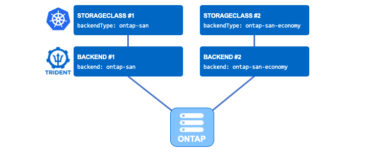

# Create your first SAN backends

**Objective:**  
You have mastered how to create backends and understand what they are used for.  You probably also created a few backends with the NFS drivers.  
It is now time to add more backends that can be used for block storage.  

The ONTAP environment in the lab has already been setup for block storage. You can choose to use the SVM you are already using, or create your own. In the latter scenario, please refer to  task [Prepare ONTAP for block storage on dev cluster](../../tasks/ontap_block).  



**Note:** All below commands are to be run against the dev cluster. Unless specified differently, please connect using PuTTY to the dev k8s cluster's master node (**`rhel5`**) to proceed with the task.  

**Note:** It is a pre-requisite that not only has Trident been installed on the dev cluster but also running release **`20.07`** or above!  

## A. Create your first SAN backends

In this directory you will find the following backends configuration files:

|   Backend Name |   NetApp Storage Driver |  
|----------------|-------------------------|  
|   dev-backend-ontap-san.json |  ONTAP-SAN |  
|   dev-backend-ontap-san-eco.json |  ONTAP-SAN-ECONOMY |  
|   dev-backend-san-default.json |   ONTAP-SAN |  
|   dev-backend-san-eco-default.json |  ONTAP-SAN-ECONOMY |  

**Note:** From a bi-directional CHAP authentication point-of-view the ```dev-backend-san[-eco]-default``` backend configuration files match the production kubernetes cluster backend files at the time of building the bootcamp environment.  If you have subsequently updated the the CHAP credentials as part of the [CHAP, rotating credentials and updating backends](../block_app#f-chap-rotating-credentials-and-updating-backends) you will need to use ```dev-backend-ontap-san[-eco]``` backend configuration files instead.  

You can decide to use all of them, only a subset of them or modify them as you wish.

:boom: **Here is an important statement if you are planning on using these drivers in your environment.** :boom:  
The **default** is to use **all data LIF** IPs from the SVM and to use **iSCSI multipath**.  
Specifying an IP address for the **dataLIF** for the ontap-san* drivers forces the driver to **disable** multipath and use only the specified address.  

If you take a closer look at the json files, you will see that the parameter dataLIF has not been set, therefore enabling multipathing.  

First off, make sure you are in the correct path for this task:

```bash
[root@rhel5 ~]#  cd ~/netapp-bootcamp/trident_with_k8s/tasks/config_block/
```

```bash
[root@rhel5 config_block]# tridentctl -n trident create backend -f dev-backend-san-default.json
+-----------------+----------------+--------------------------------------+--------+---------+
|      NAME       | STORAGE DRIVER |                 UUID                 | STATE  | VOLUMES |
+-----------------+----------------+--------------------------------------+--------+---------+
| ontap-block-rwo | ontap-san      | 48c4b8f9-4afa-433d-884c-4d4823580705 | online |       0 |
+-----------------+----------------+--------------------------------------+--------+---------+

[root@rhel5 config_block]# tridentctl -n trident create backend -f dev-backend-san-eco-default.json
+---------------------+-------------------+--------------------------------------+--------+---------+
|        NAME         |  STORAGE DRIVER   |                 UUID                 | STATE  | VOLUMES |
+---------------------+-------------------+--------------------------------------+--------+---------+
| ontap-block-rwo-eco | ontap-san-economy | dad07e99-f22f-4f62-9da2-90f953fa6833 | online |       0 |
+---------------------+-------------------+--------------------------------------+--------+---------+

[root@rhel5 config_block]# kubectl get -n trident tridentbackends
NAME        BACKEND               BACKEND UUID
tbe-6qphb   ontap-block-rwo-eco   dad07e99-f22f-4f62-9da2-90f953fa6833
tbe-8l4vt   ontap-block-rwo       48c4b8f9-4afa-433d-884c-4d4823580705
```

## B. Create storage classes pointing to each new backend

You will also find in this directory a few storage class files.

You can decide to use all of them, only a subset of them or modify them as you wish

```bash
[root@rhel5 config_block]# kubectl create -f sc-csi-ontap-san.yaml
storageclass.storage.k8s.io/sc-block-rwo created

[root@rhel5 config_block]# kubectl create -f sc-csi-ontap-san-eco.yaml
storageclass.storage.k8s.io/sc-block-rwo-eco created
```

Feel free to see how your Grafana dashboard has updated since you added the backends and storageclasses.

## C. What's next

Now, you have some SAN backends & some storage classes configured. You can proceed to the creation of a stateful application:  

- [Deploy your first app with Block storage](../block_app)  

or stay in the dev cluster to:

- [Specify a default storage class](../default_sc)  

---
**Page navigation**  
[Top of Page](#top) | [Home](/README.md) | [Full Task List](/README.md#dev-k8s-cluster-tasks)
