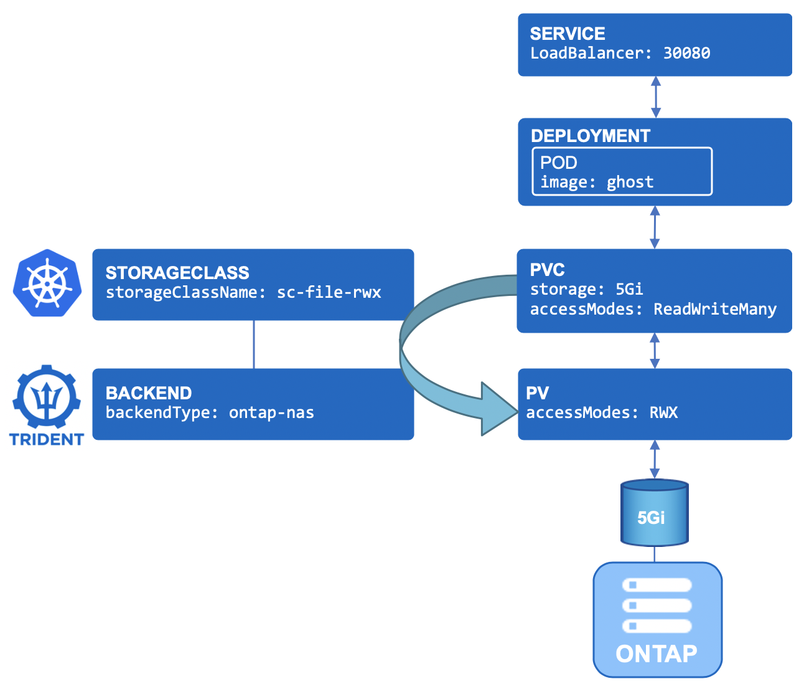
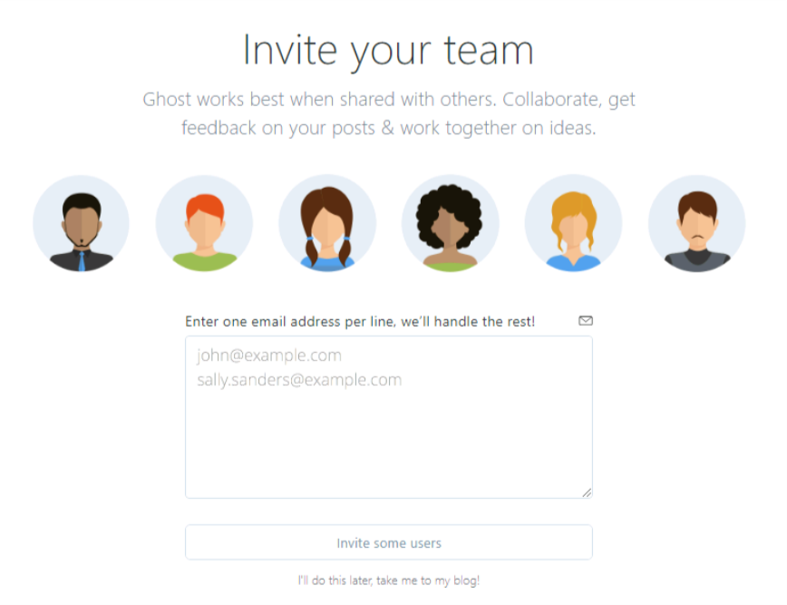
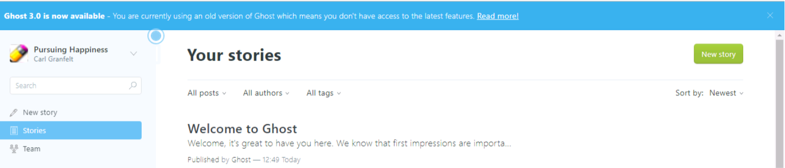
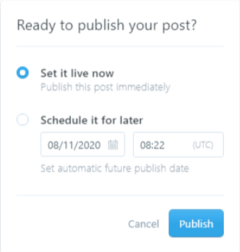
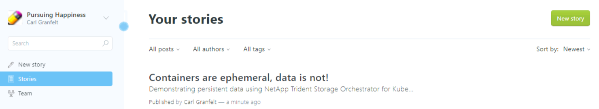
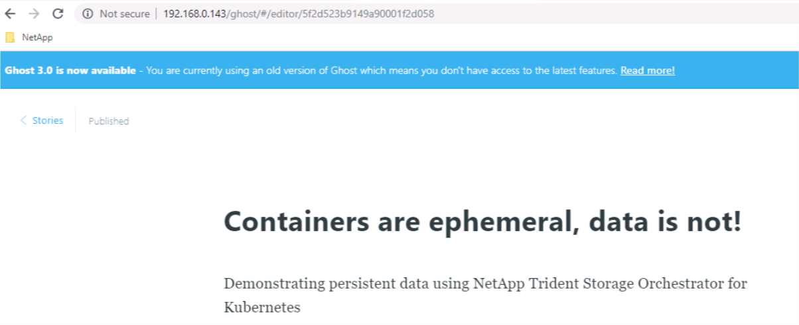

# Creating Your First Application with File (RWX) Storage

**Objective:**  
Now that you have a lab with Trident configured and storage classes, you can request a Persistent Volume Claim (PVC) for your application.  

For this task you will be deploying Ghost (a light weight web portal) utlilising RWX (Read Write Many) file-based persistent storage over NFS.  You will find a few .yaml files in the Ghost directory, so ensure that your putty terminal on the lab is set to the correct directory for this task:

```bash
[root@rhel3 ~]# cd /root/NetApp-LoD/trident_with_k8s/tasks/file_app/ghost
```

The .yaml files provided are for:

- A PVC to manage the persistent storage of this application
- A DEPLOYMENT that will define how to manage the application
- A SERVICE to expose the application

Feel free to familiarise yourself with the contents of these .yaml files if you wish.  You will see in the ```1_pvc.yaml``` file that it specifies ReadWriteMany as the access mode, which will result in k8s and Trident providing an NFS based backend for the request.  A diagram is provided below to illustrate how the PVC, deployment, service and surrounding infrastructure all hang together:

<p align="center"></p>

## A. Create the application

From this point on, it is assumed that the required backend & storage class have [already been created](../config_file) either by you or your bootcamp fascilitator.

We will create this application in its own namespace (which also makes clean-up easier).  

```bash
[root@rhel3 ghost]# kubectl create namespace ghost
namespace/ghost created
```

Next, we apply the .yaml configuration within the new namespace:

```bash
[root@rhel3 ghost]# kubectl create -n ghost -f ../ghost/
persistentvolumeclaim/blog-content created
deployment.apps/blog created
service/blog created
```

Display all resources for the ghost namespace (your specific pod name of blog-XXXXXXXX-XXXX will be unique to your deployment and will need to be used again layter in this task):

```bash
[root@rhel3 ghost]# kubectl get all -n ghost
NAME                        READY   STATUS              RESTARTS   AGE
pod/blog-6bf7df48bb-b7d6r   0/1     ContainerCreating   0          15s

NAME           TYPE           CLUSTER-IP      EXTERNAL-IP     PORT(S)        AGE
service/blog   LoadBalancer   10.100.117.77   192.168.0.143   80:30080/TCP   14s

NAME                   READY   UP-TO-DATE   AVAILABLE   AGE
deployment.apps/blog   0/1     1            0           15s

NAME                              DESIRED   CURRENT   READY   AGE
replicaset.apps/blog-6bf7df48bb   1         1         0       15s
```

List the PVC and PV associated with the ghost namespace:

```bash
[root@rhel3 ghost]# kubectl get pvc,pv -n ghost
NAME                                 STATUS   VOLUME                                     CAPACITY   ACCESS MODES   STORAGECLASS   AGE
persistentvolumeclaim/blog-content   Bound    pvc-f0b2655f-b451-4087-b68c-9f2416ec999a   5Gi        RWX            sc-file-rwx    2m6s

NAME                                                        CAPACITY   ACCESS MODES   RECLAIM POLICY   STATUS   CLAIM                                     STORAGECLASS   REASON   AGE
persistentvolume/pvc-f0b2655f-b451-4087-b68c-9f2416ec999a   5Gi        RWX            Delete           Bound    ghost/blog-content                        sc-file-rwx             2m4s
...
```

## B. Access the application

It takes about 40 seconds for the POD to be in a *running* state.

The Ghost service is configured with a LoadBalancer type, which means you need to find the **external IP** for your application so that you can connect to it via a web browser in your lab:

```bash
[root@rhel3 ghost]# kubectl get svc -n ghost
NAME   TYPE           CLUSTER-IP      EXTERNAL-IP     PORT(S)        AGE
blog   LoadBalancer   10.100.117.77   192.168.0.143   80:30080/TCP   2m59s
```

Grab the external IP from the output and check to see if you can browse to your new ghost application with persistent NFS storage.

## C. Explore the application container

Let's see if the */var/lib/ghost/content* folder is indeed mounted to the NFS PVC that was created.  
**You need to customize the following commands with the POD name you have in your environment.**

```bash
[root@rhel3 ghost]# kubectl exec -n ghost blog-6bf7df48bb-b7d6r -- df /var/lib/ghost/content
Filesystem           1K-blocks      Used Available Use% Mounted on
192.168.0.135:/nas1_pvc_f0b2655f_b451_4087_b68c_9f2416ec999a
                       5242880       704   5242176   0% /var/lib/ghost/content
```

List out the files found in the ghost/content directory within the PV (don't forget to use your specific blog-XXXXXXXX-XXXX details found in the earlier CLI output):

```bash
[root@rhel3 ghost]# kubectl exec -n ghost blog-6bf7df48bb-b7d6r -- ls /var/lib/ghost/content
apps
data
images
logs
settings
themes
```

It is recommended that you also monitor your environment from the pre-created dashboard in Grafana: (<http://192.168.0.141>).  If you carried out the tasks in the [verifying your environment](../verify_lab) task, then you should already have your Grafana username and password which is ```admin:prom-operator```.

## D. Confirm data persistence

Access the Ghost admin portal using the LoadBalancer address on <http://192.168.0.143/admin>

```bash
[root@rhel3 ghost]# kubectl get svc -n ghost
NAME   TYPE           CLUSTER-IP      EXTERNAL-IP     PORT(S)        AGE
blog   LoadBalancer   10.100.117.77   192.168.0.143   80:30080/TCP   2m59s
```

**Note:** The portal will automatically forward you to <http://192.168.0.143/ghost/#/setup/one>

Complete the Ghost setup using following steps:

1. Select 'Create your account'  
2. Give your Blog site a title
3. Enter your name
4. Give it an email address in correct format, for example user@user.com
5. Enter a password that you will remember
6. Finally, press on 'Last step: Invite your team' to proceed

<p align="center"></p>

Optionally select to save the password in Chrome.

Instead of inviting any team members select 'I'll do this later, take me to my blog!'

<p align="center"></p>

Select 'New story' from the main Stories page:

<p align="center"></p>

Give your blog post a title and add some content. Select Publish (from the top right hand corner),followed by Publish in the 'Ready to publish your post' pop-up window. 

<p align="center"></p>

Go back to the main Stories page (link in the top left corner) to confirm the presence of your blog post:

<p align="center"></p>

**Note:** Due to DNS limitations selectiong 'View Post' will not work in this lab environment.

Next let's confirm whcih worker node your pod is running on:

```bash
[root@rhel3 ghost]# kubectl get pod -l app=blog -n ghost -o wide
NAME                    READY   STATUS    RESTARTS   AGE   IP          NODE    NOMINATED NODE   READINESS GATES
blog-6bf7df48bb-b7d6r   1/1     Running   0          29m   10.42.0.1   rhel4   <none>           <none>
```

If we had multiple pods in the namespace using the selector (-l, --selector='': Selector (label query)) would be crucial to to filter the desired output.

Now that we know that our pod is running on node ```rhel4``` we can drain the node in preparation for maintenance which will also restart the pod on another node:

```bash
[root@rhel3 ghost]# kubectl drain rhel4 --ignore-daemonsets
node/rhel4 cordoned
WARNING: ignoring DaemonSet-managed Pods: kube-system/kube-proxy-q8226, kube-system/weave-net-fgt2v, metallb-system/speaker-n96jl, monitoring/prom-operator-prometheus-node-exporter-lq4wv, trident/trident-csi-zmg7q
evicting pod ghost/blog-6bf7df48bb-b7d6r
pod/blog-6bf7df48bb-b7d6r evicted
node/rhel4 evicted
```

**Note:** Your pod might be running on a different node!

Following on we can re-confirm the new host the pod is running on (as it might take a few seconds we have added the -w option to ‌watch for the changes take place):  

```bash
 [root@rhel3 ghost]# kubectl get pod -w -l app=blog -n ghost -o wide
NAME                    READY   STATUS              RESTARTS   AGE   IP       NODE    NOMINATED NODE   READINESS GATES
blog-6bf7df48bb-fflsl   0/1     ContainerCreating   0          52s   <none>   rhel1   <none>           <none>
blog-6bf7df48bb-fflsl   1/1     Running             0          53s   10.36.0.6   rhel1   <none>           <none>
```

**Note:** Notice the new pod name and that the age has been reset! Press ```Ctrl-C``` to close to escape.  

Finally refresh your browser window and actually access your blog post to confirm it still exists:

<p align="center"></p>

To mark our node as schedulable again we need to uncordon it and verify that it's in a ready status:

```bash
[root@rhel3 ghost]# kubectl uncordon rhel4
node/rhel4 uncordoned

[root@rhel3 ghost]# kubectl get no
NAME    STATUS   ROLES    AGE     VERSION
rhel1   Ready    <none>   336d    v1.18.0
rhel2   Ready    <none>   336d    v1.18.0
rhel3   Ready    master   336d    v1.18.0
rhel4   Ready    <none>   3d21h   v1.18.0
```

## E. Cleanup (optional)

:boom: **The PVC will be reused in the '[Importing a PV](../pv_import)' task. Only clean-up if you dont plan to do the 'Importing a PV' task.** :boom:  

If you still want to go ahead and clean-up, instead of deleting each object one by one, you can directly delete the namespace which will then remove all of its associated objects.  

```bash
[root@rhel3 ~]# kubectl delete ns ghost
namespace "ghost" deleted
```

## F. What's next

Hopefully you are getting more familiar with Trident and persistent storage in k8s now. You can move on to:  

- Next task: [Deploy your first application using Block storage](../block_app)  

or jump ahead to...

- [Use the 'import' feature of Trident](../pv_import)  
- [Consumption control](../quotas)  
- [Resize an NFS PVC](../resize_file)  

---
**Page navigation**  
[Top of Page](#top) | [Home](/README.md) | [Full Task List](/README.md#prod-k8s-cluster-tasks)
