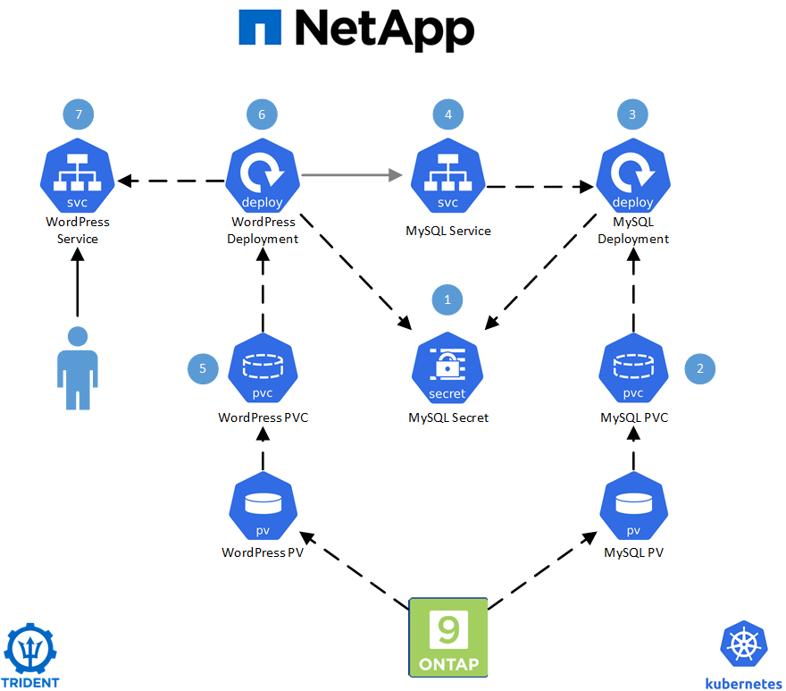
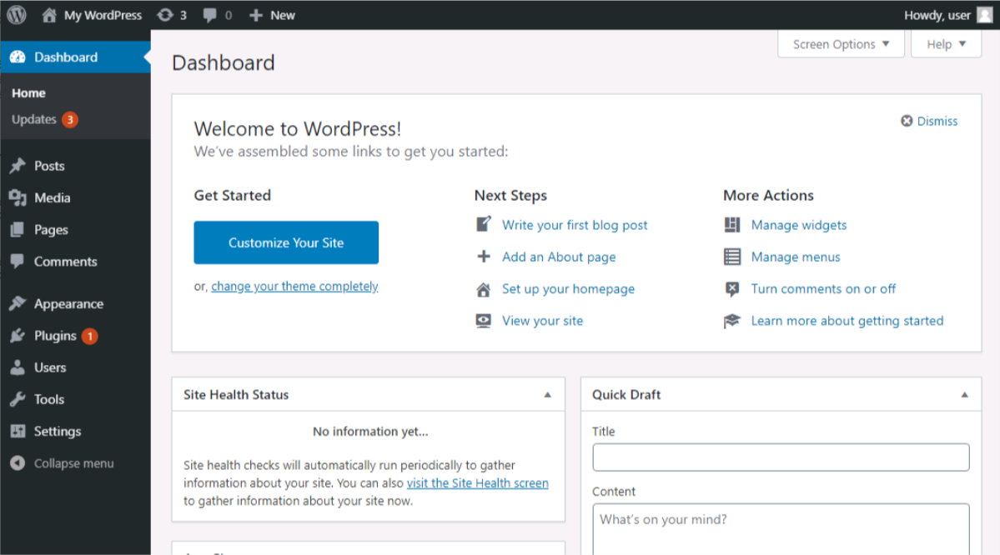

# WordPress Application

## Application Layout

The WordPress application utilises a MySQL database and NetApp Trident to automatically provision persistent volumes from a NetApp ONTAP based storage system.  
The layout for the WordPress application will be as per below: -

 

 

The end result will be a WordPress application which uses persistent storage to save it's configuration information.

 

---
**Page navigation**  
[Top of Page](#top) | [Home](/README.md) | [Full Task List](/README.md#prod-k8s-cluster-tasks)
